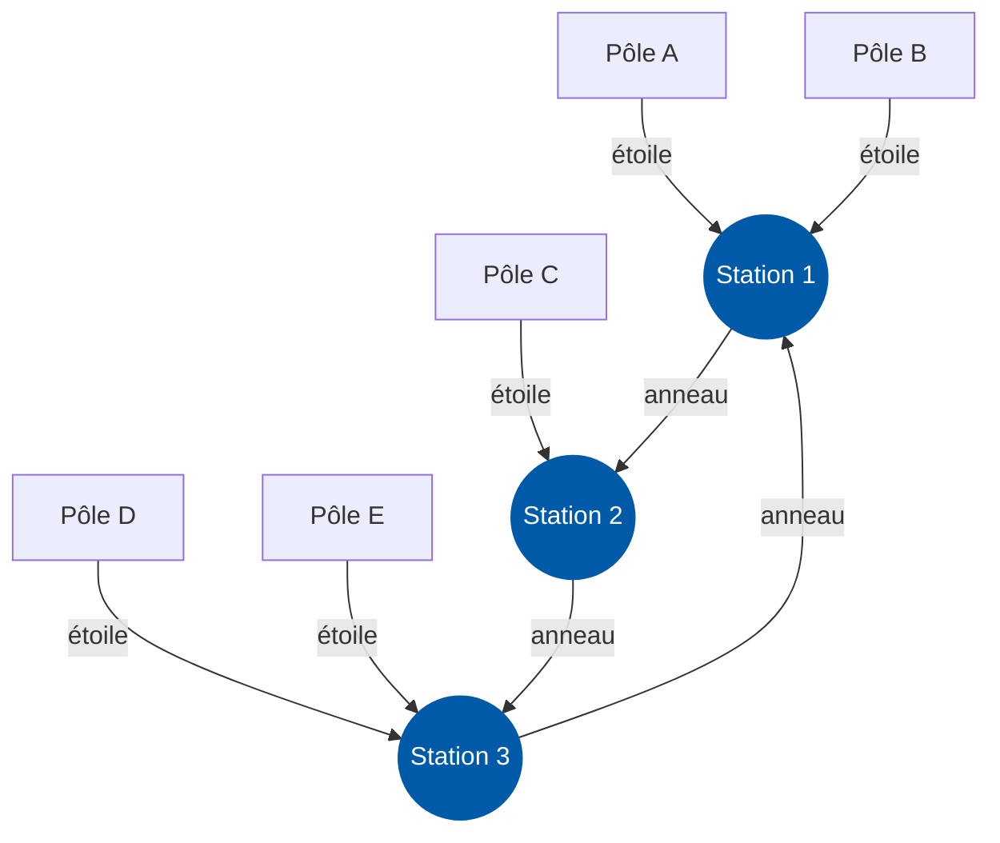
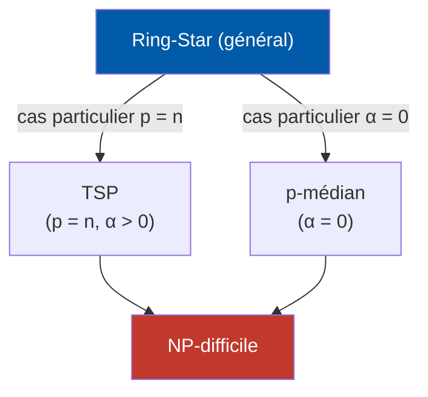
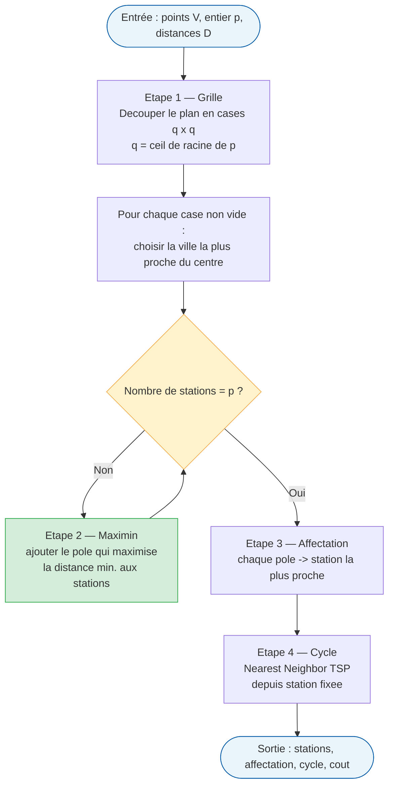
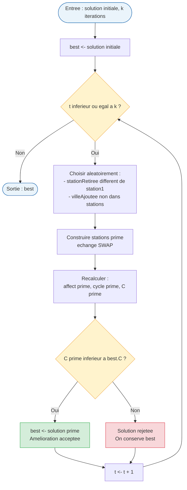
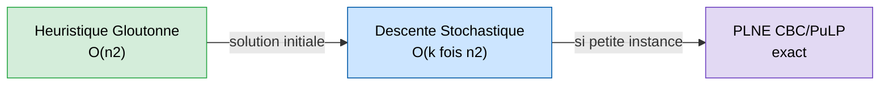

# Optimisation du tracé d'une ligne de métro circulaire
**SAÉ Optimisation 2025-2026 — Problème Ring-Star**

*Université Sorbonne Paris Nord — Sup Galilée · 30 Janvier 2026*

---

## Introduction

L'optimisation des réseaux de transport public constitue un enjeu majeur de l'aménagement urbain moderne. Dans les grandes agglomérations, la conception d'une ligne de métro circulaire doit concilier plusieurs objectifs : couvrir le territoire, limiter les coûts d'infrastructure et réduire les temps de déplacement des usagers.

Le territoire est représenté par un ensemble de $n$ pôles d'activité (quartiers, gares, centres commerciaux, etc.). Parmi ces pôles, on doit en choisir exactement $p$ pour y installer des stations de métro :

- Les stations sont reliées entre elles par une **ligne circulaire unique** (l'anneau).
- Chaque pôle non desservi est rattaché à la station la plus proche par un **lien en étoile** (marche, navette…).

L'objectif est de minimiser une fonction de coût combinant :
1. le coût de construction et d'exploitation de la ligne circulaire,
2. le coût d'accès des usagers depuis leur pôle jusqu'à leur station de rattachement.

> **Compromis fondamental :** plus on ouvre de stations, plus le cycle s'allonge (coût élevé) mais plus les distances à pied diminuent. Peu de stations réduisent le coût du cycle mais augmentent les trajets d'accès.

### Structure générale d'une solution Ring-Star

---

## NP-difficulté du problème Ring-Star

Avant de concevoir des algorithmes de résolution, il est essentiel de caractériser la difficulté algorithmique du problème. Le problème Ring-Star est **NP-difficile**, ce qu'on démontre en exhibant deux problèmes classiques NP-difficiles comme cas particuliers.

### Lien avec le TSP (Voyageur de commerce)

Si $p = n$ (chaque pôle est une station), il n'y a plus de lien en étoile et le coût d'affectation est nul. Le problème se réduit à la recherche d'un cycle passant exactement une fois par chaque sommet en minimisant la somme des longueurs des arêtes — c'est exactement le **TSP**, connu pour être NP-difficile.

### Lien avec le problème du p-médian

Si $\alpha = 0$ (le coût de l'anneau est nul), la fonction objectif ne dépend plus que des distances d'affectation. Le problème consiste alors à sélectionner $p$ stations et à affecter chaque pôle à sa station la plus proche pour minimiser la somme des distances. C'est exactement le **problème du p-médian**, lui aussi NP-difficile.

### Positionnement du Ring-Star

Le problème Ring-Star généralise à la fois le TSP ($p = n$) et le p-médian ($\alpha = 0$). On ne peut donc pas garantir une résolution exacte en temps polynomial pour des instances de grande taille, d'où l'intérêt des méthodes approchées.

---

## Modélisation mathématique (PLNE)

Pour obtenir des solutions optimales sur des instances de taille raisonnable, on utilise une formulation en **programmation linéaire en nombres entiers (PLNE)**, implémentée avec PuLP et le solveur CBC.

### Variables de décision

| Variable | Type | Signification |
|---|---|---|
| $y_{ij} \in \{0,1\}$ | Binaire | $y_{ij} = 1$ si le pôle $i$ est rattaché à la station $j$ ; $y_{jj} = 1$ si $j$ est station |
| $x_{ij} \in \{0,1\}$ | Binaire | $x_{ij} = 1$ si l'arête $\{i,j\}$ appartient au cycle (pour $i < j$) |
| $z_{ij} \ge 0$ | Flot | Variables de flot pour assurer la connexité du cycle (élimination des sous-tours) |

Les variables $y$ et $x$ définissent la solution, tandis que $z$ sert à imposer la structure du cycle.

### Fonction objectif

$$\min \quad \alpha \sum_{\{i,j\}} D_{ij} \, x_{ij} + \sum_{i,j} D_{ij} \, y_{ij}$$

- **Premier terme :** coût du cycle métro (longueur totale pondérée par $\alpha$).
- **Second terme :** somme des distances d'affectation pôle → station.

### Contraintes principales

- **Exactement $p$ stations :** $\sum_j y_{jj} = p$
- **Affectation unique :** $\sum_j y_{ij} = 1$ pour tout $i$
- **Cohérence affectation/station :** $y_{ij} \le y_{jj}$ (on n'affecte $i$ à $j$ que si $j$ est station)
- **Station fixée :** $y_{11} = 1$ et $y_{1j} = 0$ pour $j \neq 1$
- **Degré 2 dans le cycle :** $\sum_{j \neq i} x_{\{i,j\}} = 2\, y_{ii}$ pour chaque station
- **Connexité (flot) :** $z_{ij} + z_{ji} \le (p-1)\, x_{ij}$, éliminant les sous-tours

---

## Algorithmes approchés

Compte tenu de la NP-difficulté, les méthodes exactes deviennent prohibitives dès que $n$ et $p$ grandissent. Deux approches sont développées : une heuristique constructive, puis une métaheuristique pour l'améliorer.

### Heuristique constructive (gloutonne)

L'heuristique construit une solution en quatre phases :

1. **Partitionnement par grille :** on découpe le plan en $q \times q$ cases ($q \approx \lceil\sqrt{p}\rceil$) et on choisit dans chaque case non vide la ville la plus proche du centre — cela assure une répartition géographique équilibrée.
2. **Complétion Maximin :** si le nombre de stations est encore inférieur à $p$, on ajoute itérativement le pôle qui **maximise la distance minimale** vers les stations déjà choisies, évitant tout regroupement excessif.
3. **Affectation :** chaque pôle non-station est affecté à la station la plus proche (distance euclidienne).
4. **Tracé du cycle :** on construit un cycle sur les $p$ stations par l'algorithme du **plus proche voisin (Nearest Neighbor TSP)**, en partant de la station fixée.

#### Flowchart de l'heuristique gloutonne

**Complexité :** essentiellement $O(n^2)$ (matrice de distances). Fournit très rapidement une solution réalisable de qualité raisonnable.

---

### Métaheuristique : descente stochastique par échanges (SWAP)

La gloutonne peut rester bloquée dans une solution "moyenne". La métaheuristique l'améliore par petites modifications aléatoires.

**Principe d'un mouvement :**
- On retire une station (sauf la station fixée).
- On la remplace par un pôle qui n'était pas station.
- On recalcule affectations + cycle + coût total.
- Si le coût **diminue** → on accepte la nouvelle solution ; sinon, on conserve l'ancienne.

#### Flowchart de la descente stochastique

Cette approche ne garantit pas l'optimalité globale mais améliore en pratique sensiblement la solution gloutonne. Les choix aléatoires permettent d'explorer divers voisinages et d'échapper à certains optima locaux.

---

## Résumé des approches

| Méthode | Optimalité | Complexité | Usage |
|---|---|---|---|
| **PLNE (CBC)** | Exacte | Exponentielle (worst case) | Petites instances |
| **Heuristique gloutonne** | Approchée | $O(n^2)$ | Solution initiale rapide |
| **Descente stochastique** | Approchée | $O(k \cdot n^2)$ | Amélioration itérative |
